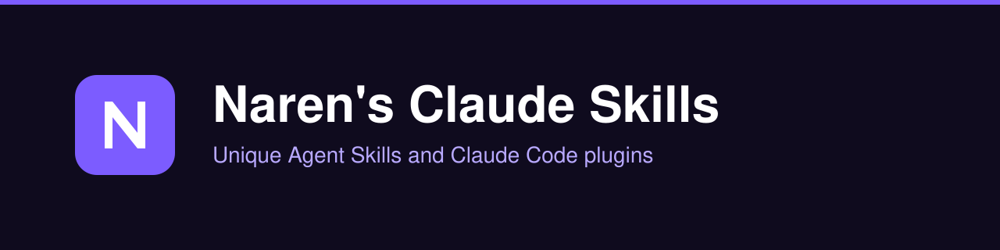

# Naren's Claude Skills

<p align="center">
  
</p>

<p align="center">
  <a href="LICENSE"></a>
  
  <a href="https://github.com/NarenDawar/narens-claude-skills/stargazers"></a>
</p>

**A growing collection of unique, installable [Claude Code](https://claude.com/claude-code) skills (Agent Skills) and plugins, crafted by Naren.** Install any skill in one command through the Claude Code plugin marketplace, or copy a `SKILL.md` folder into your own setup.

## Install

**Plugin marketplace (recommended)**

```text
/plugin marketplace add NarenDawar/narens-claude-skills
/plugin install <skill-name>@narens-claude-skills
```

**Manual copy**

Copy any `plugins/<skill-name>/skills/<skill-name>/` folder into `~/.claude/skills/`. Claude picks it up on the next session.

## Skills

<!-- CATALOG:START -->
| Skill | What it does | Install |
| --- | --- | --- |
| [`comprehension-check`](plugins/comprehension-check/README.md) | Use when the user asks to be quizzed on, or to check their understanding of, code Claude wrote this session (for example 'quiz me on that' or 'do I actually understand this change?'). | `/plugin install comprehension-check@narens-claude-skills` |
| [`decision-journal`](plugins/decision-journal/README.md) | Use when the user wants to log a prediction or estimate about a dev or project decision, grade past predictions, or see how calibrated they are (for example 'log a prediction', 'grade my predictions', 'how calibrated am I?'). | `/plugin install decision-journal@narens-claude-skills` |
| [`rule-promoter`](plugins/rule-promoter/README.md) | Use when the user wants rules in CLAUDE.md enforced with hooks, says Claude keeps ignoring a CLAUDE.md rule, or asks to turn CLAUDE.md rules into hooks (for example 'promote my CLAUDE.md rules to hooks' or 'make Claude stop editing migrations'). | `/plugin install rule-promoter@narens-claude-skills` |
| [`subagent-tax-auditor`](plugins/subagent-tax-auditor/README.md) | Use when the user asks why their Claude Code quota or usage limit runs out so fast, which subagents cost the most, or wants their subagents made cheaper (for example 'audit my subagents', 'which agent is eating my quota', 'make my agents cheaper'). | `/plugin install subagent-tax-auditor@narens-claude-skills` |
<!-- CATALOG:END -->

## Why these skills

Most skill collections are generic prompt dumps. These are small, focused, and opinionated: each one solves a specific problem, triggers precisely when it should, and is tested before it ships. Every skill is its own plugin, so you install only what you need.

## Build your own

The repo includes a skill template and a validator. See [CONTRIBUTING.md](CONTRIBUTING.md) and [docs/conventions.md](docs/conventions.md) for how skills are structured (`SKILL.md` frontmatter, trigger-first descriptions, per-skill READMEs).

## License

[MIT](LICENSE)

---

Made by [Naren](https://github.com/NarenDawar). If a skill saved you time, please star the repo.
